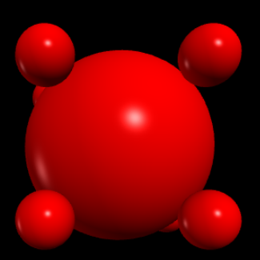
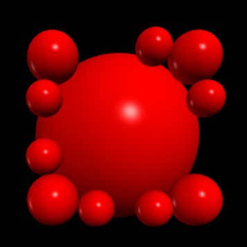
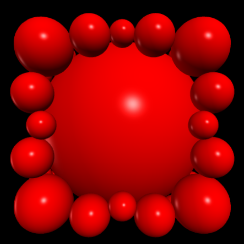
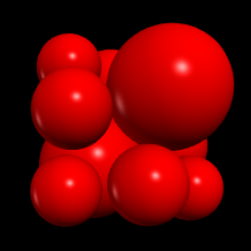
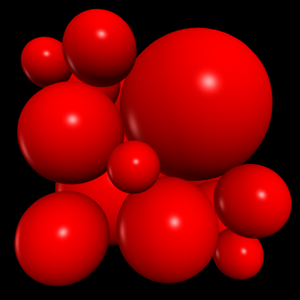

# Software-Engineering -- Draw Circles

## Usage

```bash
pyvenv .venv
. .venv/bin/activate
pip install -r requirements.txt
python main.py
```

## Result
- project3(m = 10)

- project3(m = 24)

- project3(m = 50)

- projetc4(m = 10)

- project4(m = 24)

