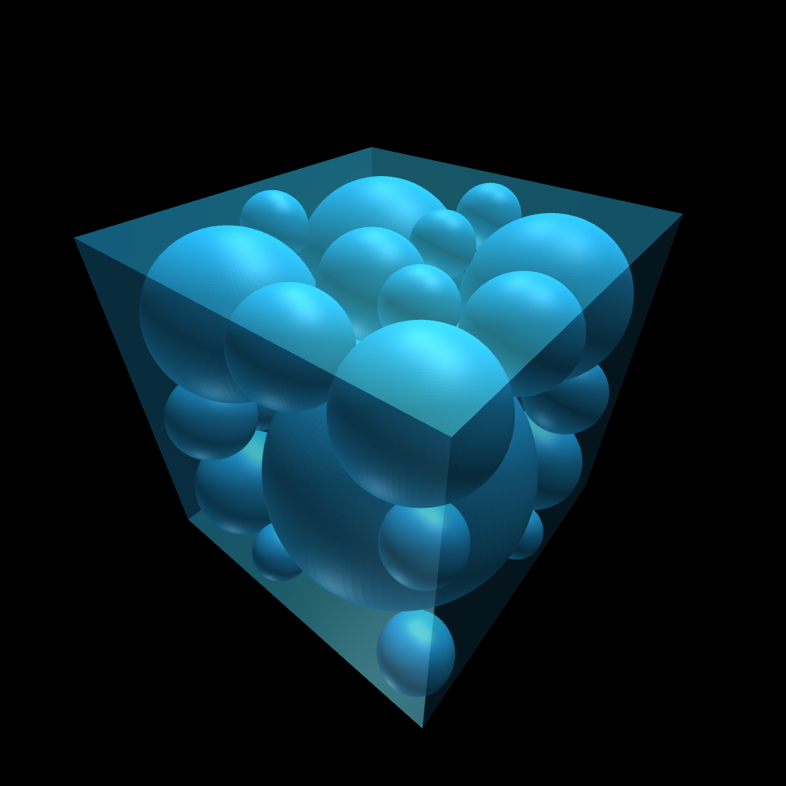

# software-engineering

In a box(3D) bounded by [-1, 1], given m balloons(they cannot overlap) with variable radio r and position mu. And some tiny blocks are in the box at given position {d}, balloons cannot overlap with these blocks. Find the optimal value of r and mu which maximizes sum r^2.

## Usage (Python 2.7)

```bash
git clone https://github.com/MartinNey/se-draw-balls.git
cd se-draw-balls
virtualenv .venv
. .venv/bin/activate
pip install -r requirements.txt
python main.py
# data calculated in a default configure should be save as /json-export/3d.json

# visualization, 8000 is port number
# open localhost:8000/visualization/ in browser
python -m SimpleHTTPServer 8000
```

## screenshots

